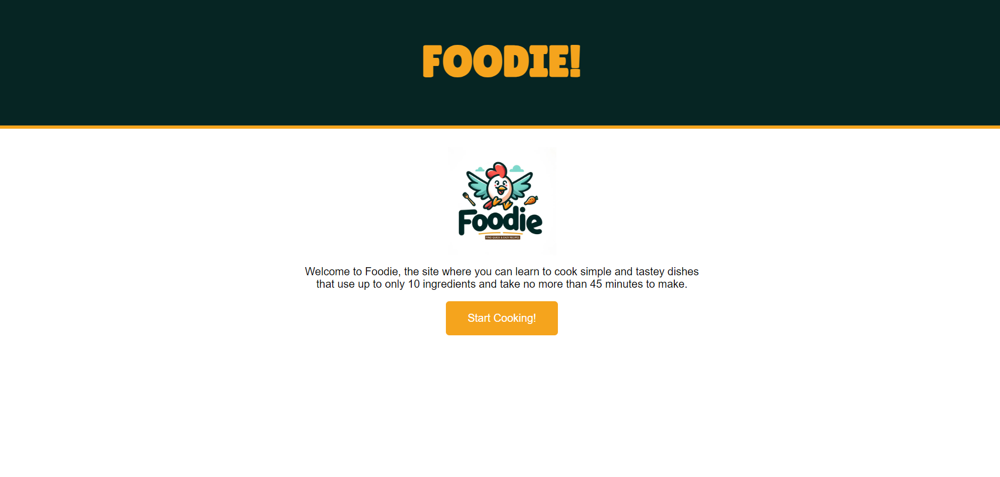

# FOODIE

## Description
To create a webpage that allows users to generate a list of recipes based on their choice of meal, cuisine and entered key words. The site specialises in quick and easy to make recpes that families can enjoy making together, and even kids can make on their own. This is because each recipe takes up to only 45 minutes and has a maximum of 10 ingredients.

## User Story
As a parent looking to simplify meal planning and involve my kids in cooking, I want to use Foodie to discover easy-to-make recipes with a focus on meals that meet our nutritious and dietary needs with short cooking times, so we can create delicious and fun meals that my family can enjoy together.

## Acceptance criteria

I can access Foodie's website and easily navigate to the recipe search feature.​
I can enter specific keywords and select a meal and cuisine type to find recipes that match my preferences.​
When I click generate recipe the recipes returned have 10 or less ingredients and a maximum cooking time of 45 minutes.​
I can view the nutritional content of each recipe as well as its health labels.​
I can view my search history to quickly access previously searched recipes for future reference.

## Process

- The first thing we did was draft up some wireframes then once we decided on one, we got started on the html using the wireframe to scaffold out the webpage.
- Then we styled our page in CSS, we decided our brand colours would be dark green and orange so we made sure those colours were prevalent on the page, and most importantly we used CSS to add responsiveness to our page.
- Since our site has 2 pages we used javascript to hide the welcome page once the user clicks the 'start cooking' button. (this then shows the welcome page)
- Then we used postman to test out our 2 APIs, edamam and pexels.
- In javascript the first thing we did was set up our API keys, base urls and ids.
- Then we set the values of the meal type, cuisine type and query input variables to nothing so it was 'undefined' using the 'let'keyword, so we could then define it later on in the code. Then we set the values of the meal type and cuisine type to the clicked option in each select element,using a change event listener. Then we set the value of the query input to the value of whatever the user eneters in the input element.
- Then the first thing we did was access the pexels API by sending a fetch request to return an image based on the user's selected meal type.
- Then we made sure to dynamically display the image on the page.
- Next we got to work on the edamam API, so we sent a fetch request to return a list of recipes based on the users selected choices of meal type, cuisine type and the searched key words.
- So we made sure that we got the recipe image, recipe link and recipe name from the edamam api.
- Then we wanted to display the nutritional information for each recipe so we created a list of variables that held a list of all the nutrients in the api that we wanted to display for each recipe set the html content of each recipe div.
- Then to display the health labels of each recipe we created 15 variables that heald the value of the first 15 health labels in each recipe.
- Then we created modals that display when a recipe cannot be found based on the user's input.
- Next we created a search history that heald all of the user's searches and displayed them on the page, using local storage, and used click event listener to allow users to click on a recent search and have that display the list of recipes of that search.
- To do this we added a click event listener to the document (specifying the .recent-searches divs as the child to listen to) [event delegation] and displays the list of recipes on the page. Because, using event delegation with $(document).on('click', '.recent-searches', ...) is typically preferred when you have dynamically added elements like the all the 'recent-searches' divs we added in the clickGenerateBtn function. So when a click event occurs on an element with the class .recent-searches, the event handler function is executed. So the queryInput and clickedQuery variables both hold the same value which is the text of the recent searches div that was clicked.
- The 'clickedRecipe' variable is used to do the following: search through the 'savedRecipes' array in local storage to find the recipe whose 'query' property matches the 'clickedQuery'. So '.find()' is a javascript method that iterates over each element in an array. So the .find() function is called on the savedRecipes array.
'recipe' is a parameter of the callback function (in .find()) that represents each element in the savedRecipes array (each recipe object) that is going to be iterated over. Then the callback functions checks for this condition (recipe.query === clickedQuery) checks if the query property of each recipe matches the clickedQuery variable, if it does the .find() method immediately returns that specific recipe object and assigns it to the variable 'clickedRecipe' So then we check with an if statement if the clickedRecipe is valid/ not undefined then we change the value of the selected meal type cuisine type and query input to the clickedRecipe's mealType & cuisineType. And the query input is set to clickedQuery's text. Then the generateRecipe function is called to create a fetch request with these values in the parameters.
- So once the local storage, search history aspect was done our site was essentially complete.

## Authors:
- Sukhri Mohamed
- Deji Lawal
- Anu Debi Tewari 

## Link to Github Repository:
https://github.com/Shukrim433/Foodie.git

## Link to deployed application:
https://shukrim433.github.io/Foodie/

## Link to the presentation:
https://1drv.ms/p/c/fa46553fefa8bdf5/EcL3fQ_pzhROkly9J2FMN2gBowU5koMg2Woqgbut-oIvbg?e=NNid7b

## Screenshot of the webpage:
